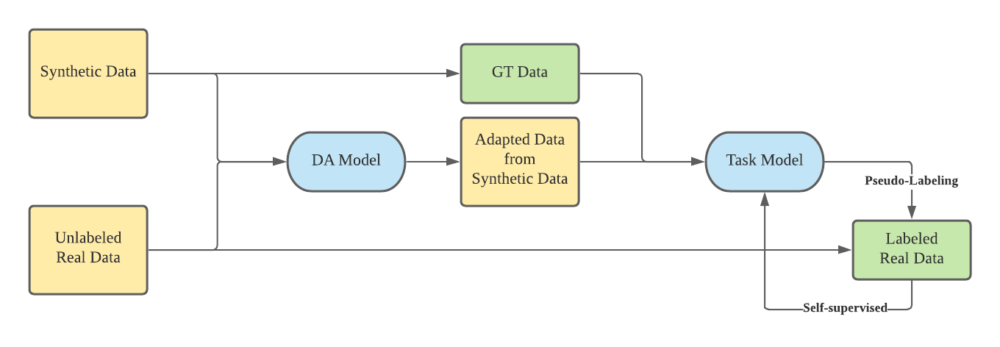

# SSL-Synthetic-Segmentation

Self-supervised learning with image based synthetic teacher model

# References

## Codes 

- [deeplab v3+](https://github.com/jfzhang95/pytorch-deeplab-xception)
- [cycada](https://github.com/jhoffman/cycada_release)
- [Unsupervised Scene Adaptation](https://github.com/layumi/Seg-Uncertainty)
- [Semantic Segmentation](https://github.com/LikeLy-Journey/SegmenTron)
